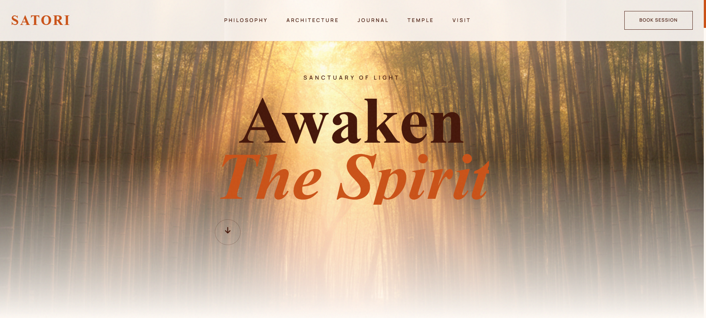

# SATORI ✦ Sanctuary of Light

> **"Awaken The Spirit."** A digital sanctuary merging nature, architecture, and wellness.


*(Remember to save your screenshot as 'preview.png' in the folder!)*

## ✧ The Vision
**SATORI** is a concept website for a spiritual retreat and architectural sanctuary. The design focuses on tranquility, using soft lighting, organic textures, and elegant typography to evoke a sense of peace immediately upon loading.

## 🛠 Tech Stack
* **Core:** HTML5, JavaScript (ES6+)
* **Styling:** Tailwind CSS (for modern, responsive layouts)
* **Animation:** GSAP (for smooth, ethereal scroll effects)
* **Fonts:** Serif Display Typography

## 🌿 Features
* **Atmospheric Visuals:** Immersive full-screen imagery with soft lighting effects.
* **Fluid Navigation:** Minimalist menu tailored for a relaxing user experience.
* **Responsive Design:** calm and accessible on any device.

## 🚀 Getting Started

To experience the sanctuary locally:

1.  Clone the repository:
    ```bash
    git clone [https://github.com/your-username/satori.git](https://github.com/your-username/satori.git)
    ```
2.  Open `index.html` in your browser.

---
*Created with mindfulness by [Your Name]*